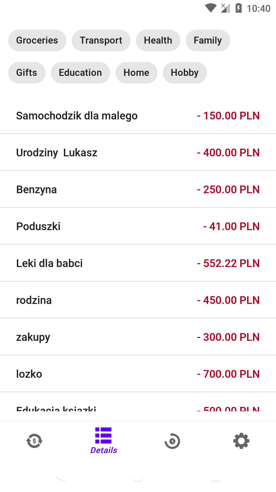
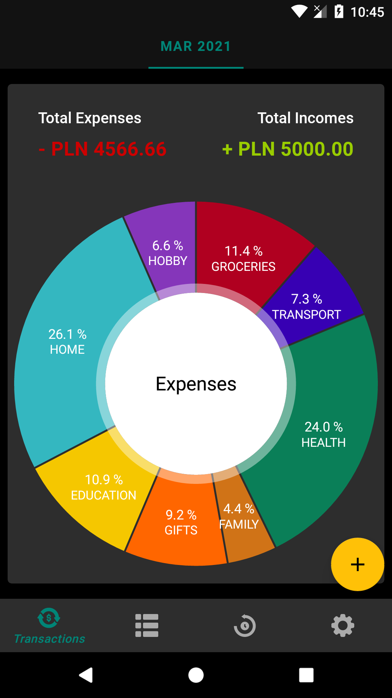
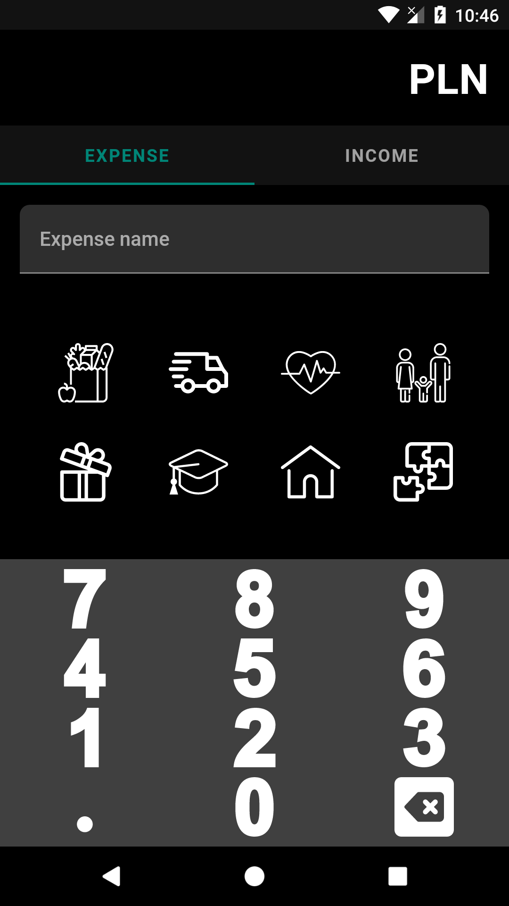
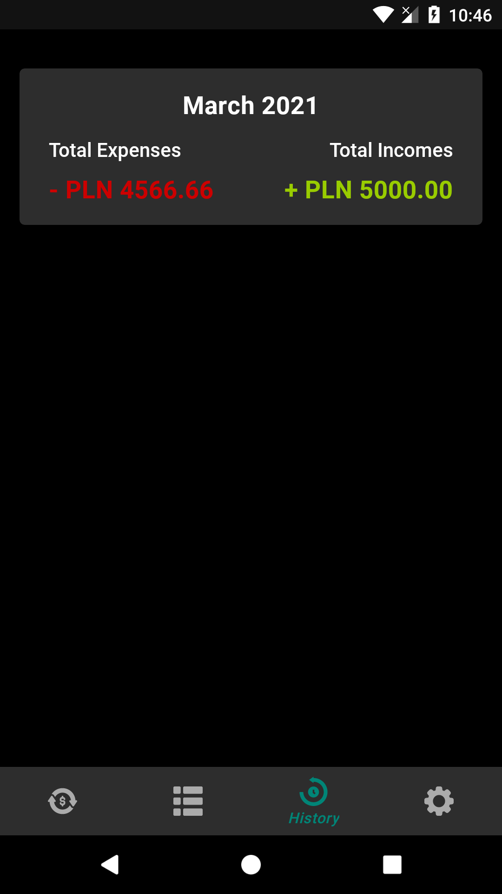

# MrBudget
> A project of budgeting mobile app.  
> It lets store data about expenses and incomes in particular months.  

## Table of contents
* [General info](#general-info)
* [Screenshots](#screenshots)
* [Technologies](#technologies)
* [Libraries Used](#libraries-used)
* [Setup](#setup)
* [Features](#features)
* [Status](#status)
* [Contact](#contact)
* [License](#license)

## General info
The MrBudget app is answer for my needs. 
I wanted to make a simple budgeting app with the support of well-known android tools for educational and my purposes.

## Screenshots

  
  
  
  
  
  
  
  
  
  

## Technologies
The application use several Android Jetpack components and tools such as :
* Data Binding   
* Lifecycles
* LiveData
* Navigation
* ViewModel
* Coroutines
* Dependency Injection
* Android KTX
* Animation & Transitions
* Fragments
* Layouts
* Material Design  

For storing data purposes app use SqLite database with Room as a abstraction layer.

## Libraries Used
Third party and miscellaneous libraries
* [Dagger-Hilt](https://dagger.dev/hilt/) for dependency injection
* [Kotlin Coroutines](https://kotlinlang.org/docs/reference/coroutines-overview.html) for managing background threads with simplified code and reducing needs for callbacks
* [Timber](https://github.com/JakeWharton/timber) more powerful logs
* [Room](https://developer.android.com/jetpack/androidx/releases/room) The Room persistence library provides an abstraction layer over SQLite to allow for more robust database access while harnessing the full power of SQLite
* [MPAndroidChart](https://github.com/PhilJay/MPAndroidChart)  A powerful & easy to use chart library for Android
* [SwipeLayout](https://github.com/chthai64/SwipeRevealLayout) A layout that you can swipe/slide to show another layout.

## Setup
No setup is needed for this app.

## Features
* Store expenses and incomes from particular months 
* Look at your expenses through a PieChart
* List your expenses and filter them by type
* Look at your previous budgets in history fragment
* Switch between dark/light mode in settings fragment

## Status
The app is currently under development.

## Contact
Created by [@PodwikaGrzegorz](mailto:podwikagrzegorz@gmail.com?subject=[GitHub]%20MrBudget%20App) - feel free to contact me!

Copyright 2020 Grzegorz Podwika

Licensed under the Apache License, Version 2.0 (the "License"); you may not use this file except in compliance with the License. You may obtain a copy of the License at

> (http://www.apache.org/licenses/LICENSE-2.0)

Unless required by applicable law or agreed to in writing, software distributed under the License is distributed on an "AS IS" BASIS, WITHOUT WARRANTIES OR CONDITIONS OF ANY KIND, either express or implied. See the License for the specific language governing permissions and limitations under the License.
